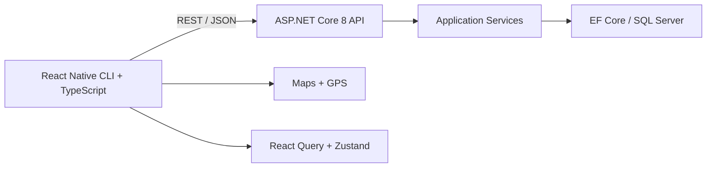

# TrekStride | Hiking & Trekking Social Fitness App 🌲

**Doğaya çık. Rotanı bırak.**

TrekStride, yürüyüş ve trekking deneyimini GPS takibi, topluluk rotaları,
haftalık ligler, başarı serileri ve kişiselleştirilmiş ilerleme ile birleştiren
React Native + .NET mobil fitness uygulamasıdır.

## Özellikler

- GPS ile yürüyüş başlatma, durdurma, süre ve mesafe takibi
- Harita üzerinde topluluk rotaları, çizgiler ve işaretçiler
- Haftalık lig, sıralama, kilometre ve yükselti istatistikleri
- Streak ve anonim kullanıcı adlarıyla sosyal deneyim
- API kullanılamadığında çalışan demo veri fallback'i
- React Query ile uzak veri önbelleği, Zustand ile yerel durum yönetimi
- Swagger ve health endpoint içeren ASP.NET Core backend

## Mimari



## Teknoloji yığını

**Mobil:** React Native CLI 0.81, TypeScript, React Navigation, Zustand,
TanStack Query, Axios, react-native-maps, react-native-geolocation-service.

**Backend:** .NET 8, ASP.NET Core Web API, C#, Entity Framework Core,
SQL Server ve Swagger/OpenAPI.

## Gereksinimler

- Node.js 20+
- JDK 17, Android Studio ve Android SDK
- .NET SDK 8
- Android Emulator veya fiziksel Android cihaz

## Hızlı başlangıç

### Backend

```powershell
cd api/TrekStride.Api
dotnet restore
dotnet run
```

Swagger: `http://localhost:5080/swagger`  
Health: `http://localhost:5080/api/health`

### Mobil uygulama

```powershell
cd mobile
npm install
npm run typecheck
npm start
```

Başka bir terminalde:

```powershell
cd mobile
npm run android
```

Android Emulator için API adresi `http://10.0.2.2:5080`, fiziksel cihaz için
bilgisayarın yerel ağ IP adresi kullanılmalıdır.

### APK üretme

```powershell
cd mobile/android
./gradlew.bat assembleDebug
```

APK: `mobile/android/app/build/outputs/apk/debug/app-debug.apk`

## API

| Method | Route | Açıklama |
|---|---|---|
| GET | `/api/health` | API çalışma durumu |
| GET | `/api/trails` | Topluluk rotaları |
| GET | `/api/trails/leaderboard` | Haftalık liderlik sıralaması |

## Proje yapısı

```text
api/TrekStride.Api/       ASP.NET Core API, servisler ve veri erişimi
mobile/src/               ekranlar, servisler, navigation ve state
mobile/android/           Android native proje ve Gradle yapılandırması
rehber.html               teknik kurulum rehberi
nedir.html                proje ve teknoloji açıklama rehberi
```

## Doğrulama

```powershell
cd mobile
npm run typecheck

cd ../api/TrekStride.Api
dotnet build --no-restore
```

## Emülatör notu

Android API 35 emülatörlerinde `System UI isn't responding` uyarısı yüksek
çözünürlük/grafik yükünden kaynaklanabilir. Bu projede kullanılan AVD profili
720×1280, 4 GB RAM ve host GPU ile yapılandırılmıştır.

## Lisans

Eğitim, prototipleme ve portföy amaçlıdır.
